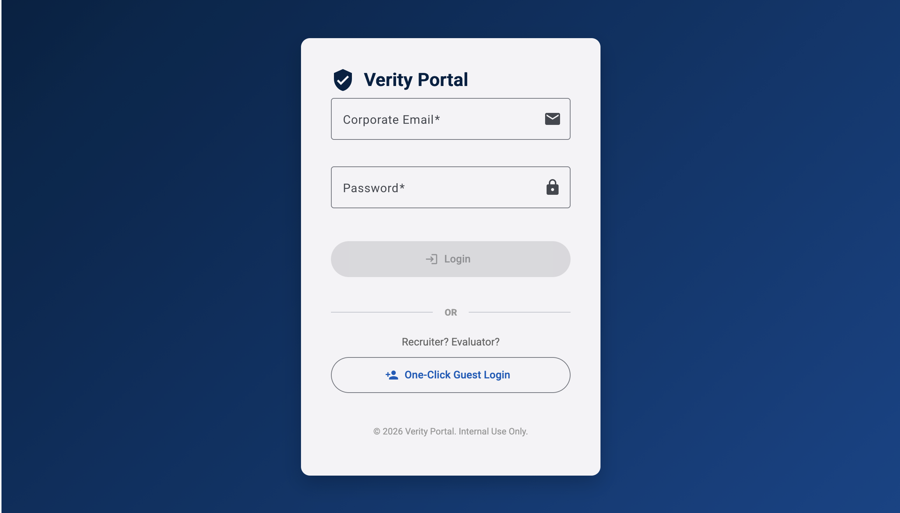

# Verity Portal

Verity Portal is a production-grade compliance platform that eliminates the risks of “Excel engineering” for organizations with strict compliance and audit requirements, where manual reconciliation of siloed data (HR, IT, Finance, Security) leads to errors, security gaps, and audit exposure. The system ingests structured data sources (.csv/.xlsx), validates and stages them, and applies a domain-driven reconciliation engine to cross-reference records against a centralized single source of truth, proactively flagging violations such as export control breaches, expired security training, and unauthorized system access. 

Designed using hexagonal architecture to isolate core compliance logic from infrastructure, enabling extensibility and testability of validation rules. Built with Python (FastAPI), PostgreSQL and Angular, and deployed via Docker on AWS App Runner with RDS, delivering a scalable, low-ops solution that reduces manual compliance effort and enables early detection of audit-critical risks.



## Key Features & Impacts
* **Intelligent Data Mapping:** A Shared Mapper Engine utilizing fuzzy logic (`thefuzz`) to intelligently suggest pairings between messy legacy spreadsheet headers and standardized system attributes, drastically reducing manual data cleaning time.
* **ITAR & Export Control Automation:** Reconciles personnel and project data to ensure restricted data is only accessed by eligible citizens, preventing ITAR/EAR violations.
* **Clearance & Training Watchdog:** Cross-references Learning Management System (LMS) and Security Office data to proactively identify expiring credentials, preventing work on contracts without valid security clearances.
* **Leaver/Mover Access Audit:** Compares Human Resources (HR) termination dates with Active Directory (AD) logins to identify unauthorized system access post-termination, supporting CMMC 2.0 (AC.L2-3.1.4) compliance.
* **IT Asset & PO Audit:** Links Procurement spend to physical IT inventory to detect "Ghost Assets" and ensure financial stewardship.
* **Labor Billing Audit:** Ensures billed labor categories match actual HR employee grades to prevent "Labor Category Creep" and support DCAA compliance.
* **Auditor-Ready Reporting:** Generates non-editable, formal PDF reports summarizing audit logic and results, alongside sanitized CSVs for secure back-system updates.

## Architecture
Verity Portal is built on a strict **Hexagonal Architecture (Ports & Adapters)** model. This ensures that the core domain logic (compliance rules, fuzzy mapping) is completely isolated from external frameworks, databases, or delivery mechanisms. This isolation guarantees that the application is highly testable, durable, and auditor-ready.

* [ADR-001: Authentication Strategy](docs/decisions/ADR-001-authentication-strategy.md)
* [ADR-002: File Storage Strategy for Data Intake](docs/decisions/ADR-002-file-storage-strategy.md)
* [ADR-003: Data Intake and Shared Mapper Strategy](docs/decisions/ADR-003-data-intake-and-mapping.md)

## Tech Stack
* **Frontend**: Angular 21 (Standalone Components, Signals), TypeScript, Angular Material
* **Backend**: Python 3.11+, FastAPI, Pandas (Data Processing), `thefuzz` (Fuzzy Matching)
* **Database**: PostgreSQL (with JSONB for dynamic data ingestion), SQLAlchemy, Alembic
* **DevOps**: Docker, Docker Compose, Poetry (Python package management)

## Security Best Practices
* **Authentication**: Stateless JWT implementation with strict Role-Based Access Control (RBAC). Passwords securely hashed via Bcrypt.
* **Data Ingestion Constraints**: File-based ingestion (CSV/XLSX) supports air-gapped/firewalled environments. Strict 50MB upload limits and extension validation prevent DoS and malicious payloads.
* **Database Segmentation**: Dedicated `verity` PostgreSQL schema to isolate application data, separating core compliance metadata from staging data (JSONB).

## Quick Start
<details>
<summary>Click to expand setup instructions</summary>

### Prerequisites
* Docker & Docker Compose
* Node.js (v20+) & npm (for local frontend development)
* Python 3.11+ & Poetry (for local backend development)

### Installation
1.  **Clone the repository:**
    ```bash
    git clone <repository-url>
    cd verity-portal
    ```

2.  **Start the Database via Docker:**
    ```bash
    docker-compose up --build -d
    ```
    This spins up the PostgreSQL database (`verity-db`) and automatically applies Alembic migrations.

3.  **Local Backend Development:**
    ```bash
    cd backend
    poetry install
    poetry run uvicorn app.main:app --reload
    ```
    The API will be accessible at `http://localhost:8000`.

4.  **Local Frontend Development:**
    ```bash
    cd frontend
    npm install
    npm start
    ```
    The Angular application will be accessible at `http://localhost:4200`.

### Running Tests
* **Backend:** `cd backend && poetry run pytest`
* **Frontend:** `cd frontend && npm test`
</details>
