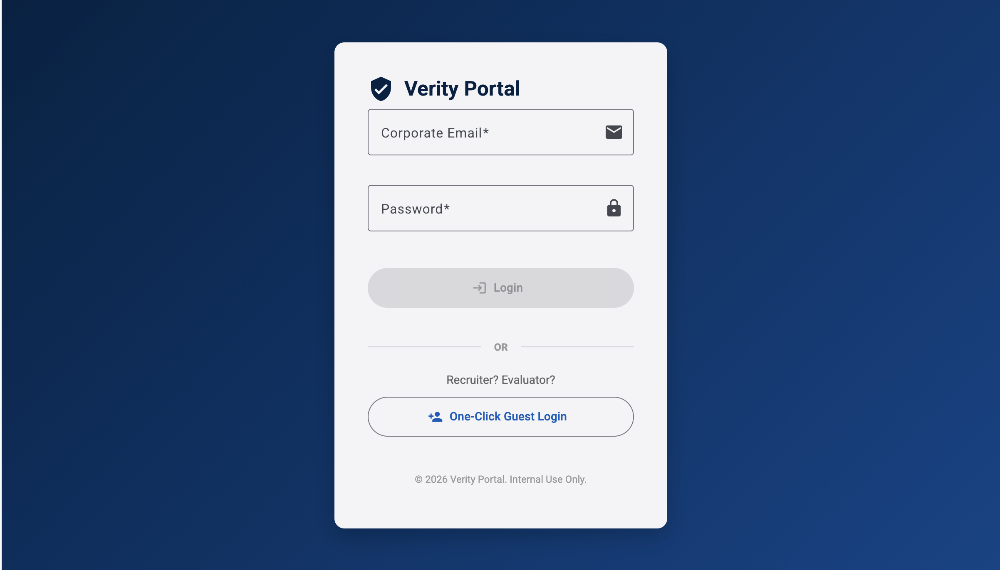

# Verity Portal

Verity Portal is a production-grade compliance platform that eliminates the risks of “Excel engineering” for organizations with strict compliance and audit requirements, where manual reconciliation of siloed data (HR, IT, Finance, Security) leads to errors, security gaps, and audit exposure. The system ingests structured data sources, validates and stages them, and applies a domain-driven reconciliation engine to cross-reference records against a centralized single source of truth, proactively flagging violations such as export control breaches, expired security training, and unauthorized system access. 

## Key Features & Impacts
* **Intelligent Data Mapping:** A Shared Mapper Engine utilizing fuzzy logic (`thefuzz`) to intelligently suggest pairings between messy legacy spreadsheet headers and standardized system attributes, drastically reducing manual data cleaning time.
* **ITAR & Export Control Automation:** Reconciles personnel and project data to ensure restricted data is only accessed by eligible citizens, preventing ITAR/EAR violations.
* **Clearance & Training Watchdog:** Cross-references Learning Management System (LMS) and Security Office data to proactively identify expiring credentials, preventing work on contracts without valid security clearances.
* **Leaver/Mover Access Audit:** Compares Human Resources (HR) termination dates with Active Directory (AD) logins to identify unauthorized system access post-termination, supporting CMMC 2.0 (AC.L2-3.1.4) compliance.
* **IT Asset & PO Audit:** Links Procurement spend to physical IT inventory to detect "Ghost Assets" and ensure financial stewardship.
* **Labor Billing Audit:** Ensures billed labor categories match actual HR employee grades to prevent "Labor Category Creep" and support DCAA compliance.
* **Auditor-Ready Reporting:** Generates non-editable, formal PDF reports summarizing audit logic and results, alongside sanitized CSVs for secure back-system updates.

## Architecture
Verity Portal is built on a **Feature-Based Layout (Vertical Slicing)** model. This ensures that each domain feature (e.g., ITAR compliance, Data Hub) is highly cohesive and decoupled from other features, communicating through explicit public contracts. This isolation guarantees that the application is highly testable, maintainable, and easily extensible.

* [ADR-001: Authentication Strategy](docs/architecture_decision_records/ADR-001-authentication-strategy.md)
* [ADR-002: File Storage Strategy for Data Intake (Superseded)](docs/architecture_decision_records/ADR-002-file-storage-strategy.md)
* [ADR-003: Data Intake and Shared Mapper Strategy](docs/architecture_decision_records/ADR-003-data-intake-and-mapping.md)
* [ADR-004: Compliance Engine and Data Export Strategy](docs/architecture_decision_records/ADR-004-compliance-engine-and-exports.md)
* [ADR-005: Feature-Based Layout (Vertical Slicing)](docs/architecture_decision_records/ADR-005-feature-based-layout.md)
* [ADR-006: Hybrid Data Ingestion Strategy (Manual UI & S3 Simulation)](docs/architecture_decision_records/ADR-006-hybrid-data-ingestion-strategy.md)
* [ADR-007: AWS S3 File Storage Strategy](docs/architecture_decision_records/ADR-007-aws-s3-file-storage-strategy.md)
* [ADR-008: Cross-Origin Resource Sharing (CORS) and Token Security Strategy](docs/architecture_decision_records/ADR-008-cross-origin-resource-sharing-strategy.md)

## Tech Stack
* **Frontend**: Angular 21 (Standalone Components, Signals), TypeScript, Angular Material
* **Backend**: Python 3.11 - 3.14 (3.13.9 recommended), FastAPI, Pandas (Data Processing), `thefuzz` (Fuzzy Matching)
* **Database**: PostgreSQL (with JSONB for dynamic data ingestion), SQLAlchemy, Alembic
* **DevOps**: Docker, Docker Compose, Poetry (Python package management)

## Security Best Practices
* **Authentication & RBAC**: Stateless JWT implementation with strict Role-Based Access Control enforcing separation of duties. Passwords securely hashed via Bcrypt. Supported roles include:
  * `ROLE_HR`: Manages master personnel records (e.g., citizenship status).
  * `ROLE_PM`: Manages project assignments and roster data.
  * `ROLE_ECO`: Export Control Officers who oversee compliance audits and violation remediation.
* **Data Ingestion Constraints**: File-based ingestion (CSV/XLSX) supports air-gapped/firewalled environments. Strict 50MB upload limits and extension validation prevent DoS and malicious payloads.
* **Database Segmentation**: Dedicated `verity` PostgreSQL schema to isolate application data, separating core compliance metadata from staging data (JSONB).

    The Angular application will be accessible at `http://localhost:4200`.

### Running Tests
* **Backend:** `cd backend && poetry run pytest`
* **Frontend:** `cd frontend && npm test`

