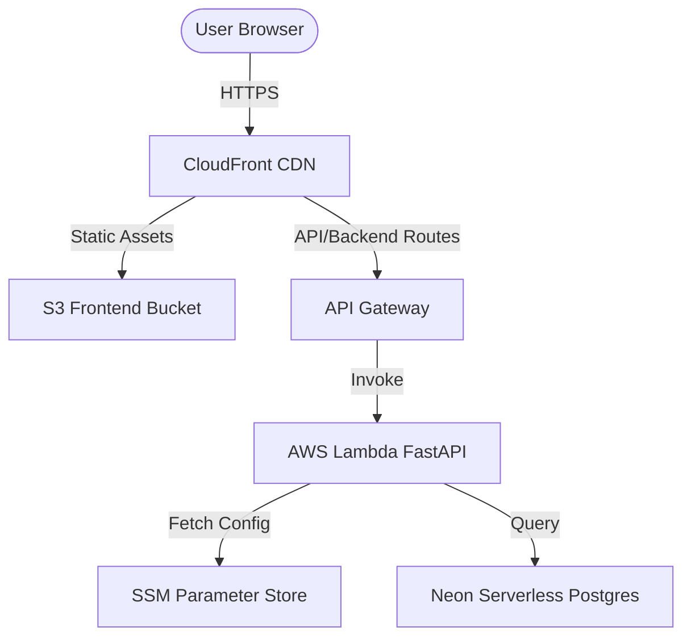
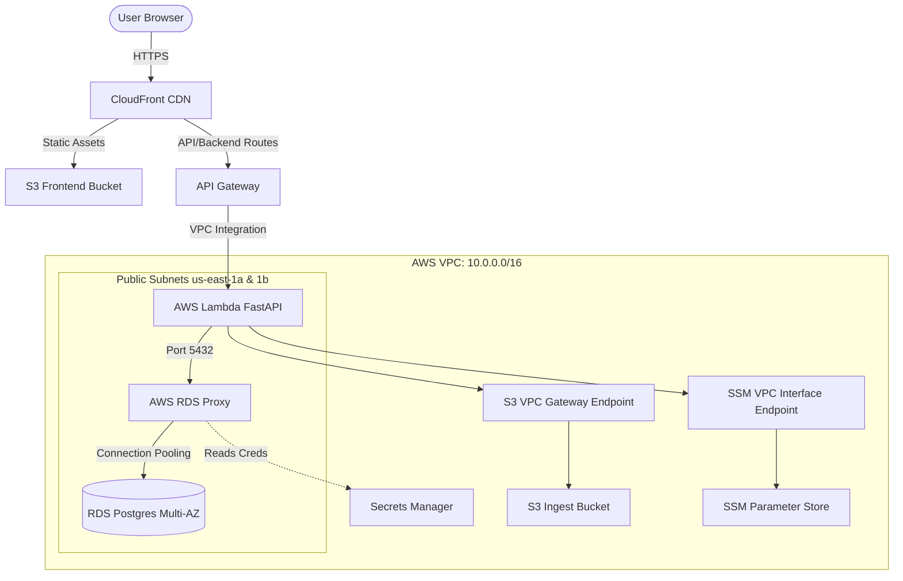

# Verity Portal

Verity Portal is a production-grade enterprise compliance platform designed to eliminate the reliance on manual "Excel engineering" for organizations with strict audit, regulatory, and data control requirements. In modern compliance environments, reconciling siloed data across Human Resources (HR), Information Technology (IT), Program Management (PM), Procurement, and Security is historically done manually via spreadsheets. This process is highly prone to errors, creates security gaps, and exposes organizations to severe regulatory violations.

Verity Portal addresses these challenges by providing an automated ingestion, validation, and domain-driven reconciliation engine that cross-references different datasets against a centralized system of record. The portal proactively flags compliance anomalies, such as Export Control (ITAR/EAR) breaches, post-termination IT system access, and financial IT inventory discrepancies, while providing non-editable, auditor-ready documentation.


---

## Core Features & Problems Solved

Verity Portal integrates and reconciles disparate organizational data to automate compliance checks across multiple domains:

### 1. Intelligent Data Ingestion & Schema Alignment (Data Hub)
* **Problem:** Messy and inconsistent column headers in spreadsheets supplied by different departments prevent automated database ingestion.
* **Solution:** A **Shared Column Mapper Engine** that utilizes fuzzy logic string matching to automatically suggest alignments between user spreadsheet headers and standardized database attributes.
* **Features:**
  * Interactive drag-and-drop file upload Dropbox (custom Angular component) supporting CSV, Excel, and Apple Numbers formats.
  * Context-aware dynamic mapping templates (`requiredSchema`) that adjust validation constraints based on the audit type (e.g., HR records vs. IT logs).
  * Guided audit workflow wizard utilizing Angular Material (`MatStepper`) to walk users through upload, mapping validation, and execution.

### 2. ITAR & Export Control Compliance
* **Problem:** Export Control regulations (like ITAR and EAR) impose heavy criminal and financial penalties if unauthorized Foreign Nationals gain access to sensitive or defense-related project data.
* **Solution:** Reconciles personnel records against project rosters using many-to-many relationship tracking to verify data access eligibility.
* **Features:**
  * Uses strict database `ENUM` boundaries for citizenship status to prevent data drift from inconsistent manual inputs.
  * Tracks project sensitivity and automatically flags foreign nationals assigned to restricted projects.
  * Provides Export Control Officers (ECO) with a dedicated compliance validation dashboard.

### 3. Leaver/Mover Access Audit
* **Problem:** Terminated or transferred employees frequently retain active accounts in IT systems due to delays in deprovisioning workflows (violating CMMC 2.0, SOC 2, and ISO 27001 controls).
* **Solution:** Automated cross-referencing of HR termination and transfer dates against IT activity logs to identify post-employment activity.
* **Features:**
  * Hybrid ingestion supporting both manual spreadsheet uploads and automated event-driven AWS S3 log drops.
  * Persistent database violation tracking supporting `OPEN` and `RESOLVED` workflow states.
  * Real-time backend email alerts dispatched to the Security Office upon detection of post-termination login attempts.
  * Dual-tab frontend violation console (Violations / Resolved) with a secure, role-based dialog for logging audit overrides and resolution justifications.

### 4. IT Asset & Purchase Order Reconciliation
* **Problem:** Organizations lose millions on "Ghost Assets"—paying licensing, support, and maintenance fees for physical hardware or software licenses that have been lost, retired, or stolen.
* **Solution:** Links physical inventory (IT Hardware lists) with financial records (Procurement Purchase Orders) to track active lifecycles.
* **Features:**
  * Joins `po_number` records directly to physical `asset_tag` tracking.
  * Highlights anomalies where procurement is paying maintenance fees for hardware not registered in the IT inventory as `IN_USE`.
  * Flags unauthorized purchases and mismatched asset categories.

### 5. Auditor-Ready Reporting
* **Problem:** Exporting audit logs as raw text or standard spreadsheets is insufficient for formal compliance reviews, as they can be easily modified or falsified.
* **Solution:** A tamper-resistant backend reporting engine that generates official audit documentation.
* **Features:**
  * Generates structured, non-editable PDF reports (utilizing `fpdf2`) detailing the audit scope, timestamps, and list of violations.
  * Exports sanitized CSV datasets for secure import into external compliance archives or downstream systems.

---

The application supports two distinct network topologies depending on the target environment, prioritizing cost-efficiency in development and high availability in production.

````carousel
### Development & Demo Topology (Scale-to-Zero)

```mermaid
graph TD
    User([User Browser]) -->|HTTPS| CF[CloudFront CDN]
    CF -->|Static Assets| S3_Front[S3 Frontend Bucket]
    CF -->|API/Backend Routes| AGW[API Gateway]
    AGW -->|Invoke| Lambda_Back[AWS Lambda FastAPI]
    Lambda_Back -->|Fetch Config| SSM[SSM Parameter Store]
    Lambda_Back -->|Query| Neon[Neon Serverless Postgres]
```
**Key Highlights:**
* **Neon Serverless PostgreSQL:** Automatically scales to zero compute when idle, resulting in $0 compute costs when inactive.
* **Public Lambda Execution:** Deployed outside a VPC, eliminating the need for NAT Gateways.
<!-- slide -->
### Production Topology (High Availability & Security)

```mermaid
graph TD
    User([User Browser]) -->|HTTPS| CF[CloudFront CDN]
    CF -->|Static Assets| S3_Front[S3 Frontend Bucket]
    CF -->|API/Backend Routes| AGW[API Gateway]
    
    subgraph VPC [AWS VPC: 10.0.0.0/16]
        subgraph Subnets [Public Subnets us-east-1a & 1b]
            Lambda_Prod[AWS Lambda FastAPI]
            Proxy[AWS RDS Proxy]
            RDS[(RDS Postgres Multi-AZ)]
        end
        
        Secrets[Secrets Manager]
        Proxy -.-> |Reads Creds| Secrets
        
        GatewayS3[S3 VPC Gateway Endpoint]
        InterfaceSSM[SSM VPC Interface Endpoint]
        
        Lambda_Prod -->|Port 5432| Proxy
        Proxy -->|Connection Pooling| RDS
        Lambda_Prod --> GatewayS3 --> S3_Ingest[S3 Ingest Bucket]
        Lambda_Prod --> InterfaceSSM --> SSM_Param[SSM Parameter Store]
    end
    
    AGW -->|VPC Integration| Lambda_Prod
```
**Key Highlights:**
* **AWS RDS PostgreSQL (Multi-AZ):** Configured with active-standby database failover across multiple availability zones for high availability and data durability.
* **AWS RDS Proxy:** Pools connection requests from backend Lambda functions to prevent exhausting database connection limits during traffic spikes.
* **Lambda in VPC:** Deployed within the VPC to allow secure private access to the RDS Proxy.
* **Cost-Optimized VPC Endpoints:** Employs an S3 Gateway Endpoint (free) and SSM Interface Endpoint to bypass public internet routing for AWS service calls, eliminating expensive NAT Gateways.
````

### 1. Vertical Slicing Architecture
Verity Portal is structured under a **Feature-Based Layout (Vertical Slicing)** model. Instead of grouping code by technology layer (controllers, models, services), code is split by cohesive business domains (e.g., `itar`, `asset_audit`, `leaver_audit`, `data_hub`, `identity`, `intake`). This separation ensures that changing one domain's logic does not affect others and facilitates modular development, testing, and extension.

### 2. Retrieval Strategy Pattern (Data Hub Ingestion)
To support both manual file drops in the UI and automated S3 background synchronizations, the system abstracts data retrieval:
* **`BaseRetrievalStrategy` (Interface):** Defines the standard contract for spreadsheet stream extraction.
* **`ManualUploadStrategy` (Concrete):** Streams files uploaded directly via the user's browser session.
* **`S3EventStrategy` (Concrete):** Streams files from AWS S3 buckets when triggered by automated event webhooks.
* **`RetrievalStrategyFactory`:** Dynamically instantiates the correct strategy depending on the entry point, passing standard dataframes to the parsing and database logic.

### 3. Concurrency-Locked Token Refresh Flow
To balance session security with a frictionless user experience, the system employs an **Access + HttpOnly Refresh Token Flow**:
* Access tokens are short-lived (30 minutes) and stored in client-side memory.
* Refresh tokens are long-lived (7 days) and stored in secure, cryptographically signed, `HttpOnly`, `SameSite=Lax` cookies.
* To prevent race conditions from concurrent dashboard requests triggering duplicate refresh requests (which violates strict token rotation), the Angular HTTP interceptor implements a RxJS-based concurrency mutex lock to serialize token renewal.

### 4. Single Domain CloudFront Reverse Proxy
Rather than deploying frontend and backend to separate subdomains (which introduces CORS preflight overhead and prevents `SameSite` HttpOnly cookie configurations), the entire platform is served under a single subdomain (`verityportal.vanmuses.com`):
* CloudFront routes path-based behaviors (e.g., `/auth/*`, `/data-hub/*`, `/leaver-audit/*`) directly to the API Gateway.
* Static Angular assets are served from S3 via Origin Access Control (OAC).
* A custom edge CloudFront Function (`spa_rewrite`) intercepts viewer requests to map SPA paths (like `/dashboard`) to `/index.html` without invoking API redirects or exposing S3 bucket details.

### 5. Serverless Scale-to-Zero Hosting
The FastAPI backend is fully containerized and deployed to **AWS Lambda**:
* Configured with **1536MB of RAM** (assigning 1 full vCPU) to mitigate cold-start module import overhead, keeping cold starts under 3 seconds.
* Integrates with **AWS WAF** (Web Application Firewall) attached directly to CloudFront to shield the backend from scanner discovery and brute force attacks.

---

## Architectural Decision Records (ADRs)

Key architectural decisions are documented in the [architecture_decision_records/](file:///Users/gabong/Documents/Programming/verity-portal/docs/architecture_decision_records) directory:

| Record ID | Title & Focus |
| :--- | :--- |
| **[ADR-001](file:///Users/gabong/Documents/Programming/verity-portal/docs/architecture_decision_records/ADR-001-authentication-strategy.md)** | Stateless JWT implementation and session lifecycle strategy. |
| **[ADR-002](file:///Users/gabong/Documents/Programming/verity-portal/docs/architecture_decision_records/ADR-002-file-storage-strategy.md)** | Initial file storage and validation choices (Superseded by ADR-007). |
| **[ADR-003](file:///Users/gabong/Documents/Programming/verity-portal/docs/architecture_decision_records/ADR-003-data-intake-and-mapping.md)** | Staging raw Excel/CSV spreadsheets using flexible PostgreSQL JSONB columns. |
| **[ADR-004](file:///Users/gabong/Documents/Programming/verity-portal/docs/architecture_decision_records/ADR-004-compliance-engine-and-exports.md)** | Domain-driven exception layout and PDF/CSV report generation strategy. |
| **[ADR-005](file:///Users/gabong/Documents/Programming/verity-portal/docs/architecture_decision_records/ADR-005-feature-based-layout.md)** | Transition to Feature-Based Layout (Vertical Slicing) to isolate business modules. |
| **[ADR-006](file:///Users/gabong/Documents/Programming/verity-portal/docs/architecture_decision_records/ADR-006-hybrid-data-ingestion-strategy.md)** | Hybrid data ingestion enabling both manual uploads and background worker processing. |
| **[ADR-007](file:///Users/gabong/Documents/Programming/verity-portal/docs/architecture_decision_records/ADR-007-aws-s3-file-storage-strategy.md)** | Cloud-native AWS S3 bucket storage adapter implementation for intake payloads. |
| **[ADR-008](file:///Users/gabong/Documents/Programming/verity-portal/docs/architecture_decision_records/ADR-008-cross-origin-resource-sharing-strategy.md)** | CORS policies and token transmission controls. |
| **[ADR-009](file:///Users/gabong/Documents/Programming/verity-portal/docs/architecture_decision_records/ADR-009-centralized-data-hub-ingestion-retrieval-abstraction.md)** | Implementation of the Ingestion Retrieval Strategy Pattern (Manual vs S3 syncs). |
| **[ADR-010](file:///Users/gabong/Documents/Programming/verity-portal/docs/architecture_decision_records/ADR-010-token-refresh-strategy.md)** | Concurrency-locked token refresh strategy with secure HttpOnly cookies. |
| **[ADR-011](file:///Users/gabong/Documents/Programming/verity-portal/docs/architecture_decision_records/ADR-011-single-domain-cloudfront-reverse-proxy.md)** | Single Domain CloudFront Reverse Proxy topology to eliminate CORS and shield APIs. |
| **[ADR-012](file:///Users/gabong/Documents/Programming/verity-portal/docs/architecture_decision_records/ADR-012-lambda-cold-start-and-initialization-timeout-remediation.md)** | AWS Lambda memory scaling and environment configuration for sub-3s cold starts. |

---

## Security Model & Access Controls

The platform implements strict access controls to maintain appropriate segregation of duties (SoD) across compliance roles:

* **Role-Based Access Control (RBAC):**
  * **`ROLE_HR` (HR Personnel Manager):** Permitted to view and upload sensitive Personnel records (e.g. citizenship status, termination dates). Access restricted from viewing project financial values or IT system actions.
  * **`ROLE_PM` (Project Manager):** Permitted to manage project rosters, assign employees, and trigger ITAR reconciliation audits.
  * **`ROLE_ECO` (Export Control Officer):** High-privilege auditing role permitted to review ITAR/export violations, review access logs, and record official compliance justifications and resolutions.
  * **`ROLE_IT` (IT System Administrator):** Permitted to manage and upload hardware inventory lists and IT login logs.
  * **`ROLE_FINANCE` (Financial Auditor):** Permitted to view Procurement data and PO audits, and resolve financial inventory discrepancies (e.g. Ghost Assets).
* **Data Ingestion Security Constraints:**
  * Rigid 50MB file size limits enforced at API and proxy levels to prevent denial-of-service (DoS) attempts.
  * Client and server-side MIME-type and extension checks restrict uploads to validated spreadsheet structures (`.csv`, `.xlsx`, `.numbers`).
  * Dedicated PostgreSQL schema `verity` isolates operational compliance metadata from unstructured raw staging uploads (JSONB data store).

---

## Tech Stack Summary

* **Frontend:**
  * Angular 21 (Standalone Components, Signals, RxJS Reactive Streams)
  * Angular Material Component Suite
  * Vanilla CSS with CSS Custom Properties
* **Backend:**
  * Python 3.11 - 3.14 (3.13.9 recommended)
  * FastAPI (RESTful API Gateway orchestration)
  * Pandas (Spreadsheet processing and normalization)
  * `thefuzz` (Fuzzy logic header recommendation algorithm)
  * `fpdf2` (Dynamic PDF generator)
* **Database:**
  * PostgreSQL (Relational and JSONB document storage)
  * SQLAlchemy (Python Object Relational Mapper)
  * Alembic (Incremental database migrations)
* **Cloud Infrastructure (AWS):**
  * CloudFront (CDN proxy & SPA routing)
  * API Gateway & AWS Lambda (Serverless FastAPI execution)
  * Simple Storage Service (S3) (Operational data drops and static assets)
  * ECR (Elastic Container Registry for Lambda container packaging)
  * AWS WAF (Web Application Firewall protection)
  * Route 53 & AWS Certificate Manager (ACM) (Single Domain DNS and SSL)
  * Terraform (Infrastructure-as-Code orchestration)
