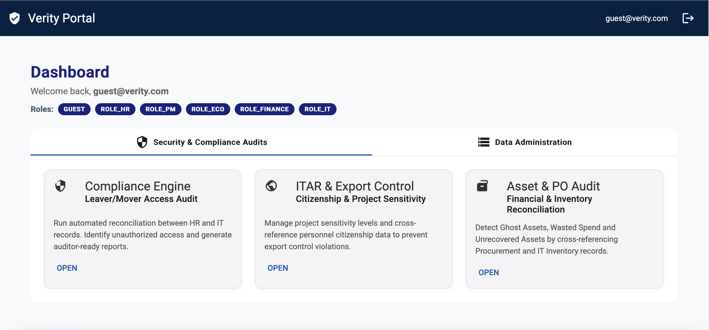
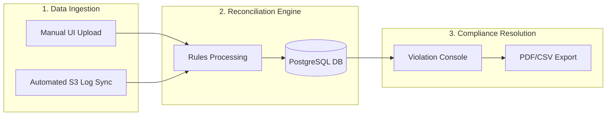
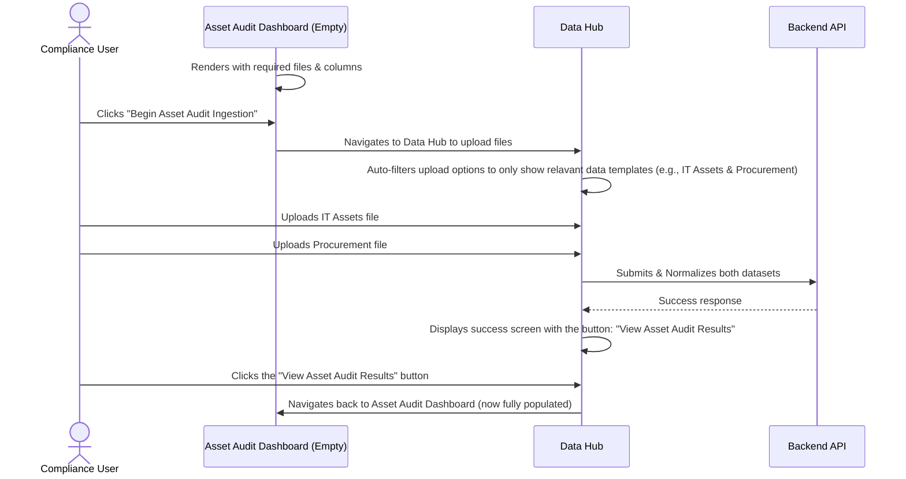
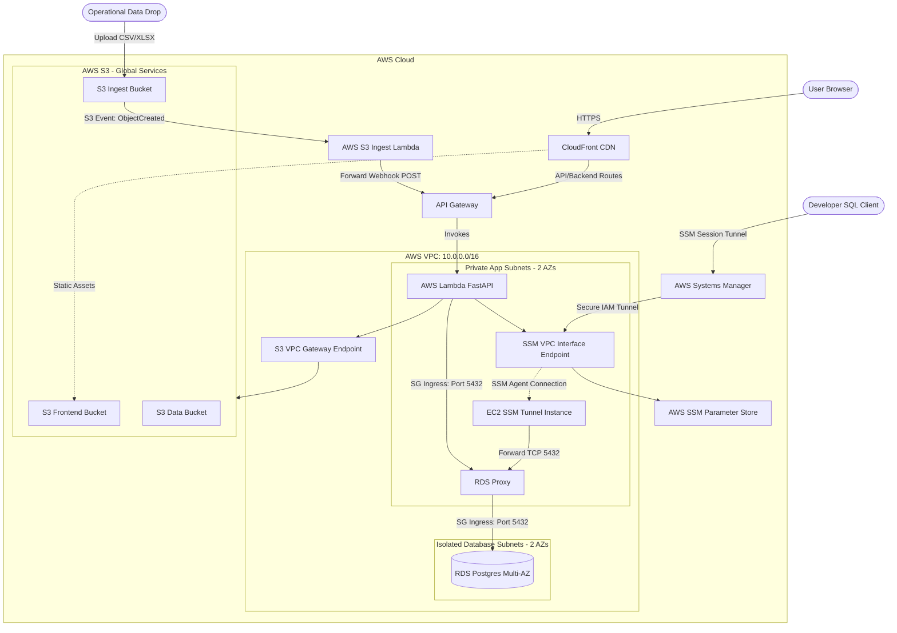

# Verity Portal

Verity Portal is a production-grade enterprise compliance platform designed to eliminate the reliance on manual "Excel engineering" for organizations with strict audit, regulatory, and data control requirements. In modern compliance environments, reconciling siloed data across Human Resources (HR), Information Technology (IT), Program Management (PM), Procurement, and Security is historically done manually via spreadsheets. This process is highly prone to errors, creates security gaps, and exposes organizations to severe regulatory violations.

Verity Portal addresses these challenges by providing an automated ingestion, validation, and domain-driven reconciliation engine that cross-references different datasets against a centralized system of record. The portal proactively flags compliance anomalies, such as Export Control (ITAR/EAR) breaches, post-termination IT system access, and financial IT inventory discrepancies, while providing non-editable, auditor-ready documentation.

Demo App Link: https://verityportal.vanmuses.com

---

## Key Features

Verity Portal cross-references and reconciles data from different departments to automatically detect and flag compliance errors across your organization:

### 1. Intelligent Data Ingestion & Schema Alignment (Data Hub)
* **Problem:** Different departments format their spreadsheets differently (for example, one team writes "Full Name" while another writes "employee_name"). This makes it impossible for standard software to automatically read and combine data without slow, error-prone manual cleanup.
* **Solution:** An **Intelligent Column Matching System** that automatically reads uploaded spreadsheets, recognizes similarly named columns (like matching "Emp_Name" to "Employee Name"), and suggests the correct alignment to the user.
* **Features:**
  * Interactive drag-and-drop file uploader supporting standard CSV, Microsoft Excel, and Apple Numbers formats.
  * Smart upload templates that adjust dynamically to verify file contents based on the type of audit (such as checking HR personnel records vs. IT login logs).
  * A step-by-step guided wizard that walks users through uploading, mapping columns, and executing compliance runs without getting lost.

### 2. ITAR & Export Control Compliance
* **Problem:** Government export regulations (like ITAR and EAR) impose severe legal and financial penalties on defense or aerospace organizations if foreign nationals gain unauthorized access to restricted project data.
* **Solution:** An automated verification system that instantly cross-references personnel citizenship status against active project rosters to verify and flag unauthorized access.
* **Features:**
  * Standardized citizenship inputs to prevent typographical errors or inconsistent values from corrupting audit data.
  * Active monitoring that flags when a foreign national is assigned to restricted or sensitive projects.
  * A dedicated validation dashboard for Export Control Officers (ECOs) to review permissions and authorize overrides.

### 3. Leaver/Mover Access Audit
* **Problem:** When employees leave a company or transfer departments, their accounts on IT systems are frequently left active due to delays in communication. This creates severe security risks and violates regulatory audits (such as SOC 2, CMMC, and ISO 27001).
* **Solution:** Automated cross-checking that compares HR termination/transfer dates against actual IT login activity to immediately catch post-employment actions.
* **Features:**
  * Dual-mode ingestion that supports both manual spreadsheet uploads and automated system log imports.
  * An audit status console to track violations from the moment they are detected until they are resolved.
  * Real-time email alerts dispatched to security teams upon detection of post-termination login attempts.
  * A secure resolution log where managers can enter official justifications and audit overrides for record-keeping.

### 4. IT Asset & Purchase Order Reconciliation
* **Problem:** Organizations waste millions on "Ghost Assets"—paying licensing, support, and maintenance fees for physical hardware or software licenses that have actually been retired, lost, or stolen.
* **Solution:** A reconciliation link connecting physical hardware inventory lists with financial purchase orders to track active assets and their costs.
* **Features:**
  * Identifies discrepancies where the finance department is paying service fees for hardware that IT does not list as active or in use.
  * Instantly flags unauthorized technology purchases and mismatched asset categories.

### 5. Auditor-Ready Reporting
* **Problem:** Sharing compliance audit logs in standard formats like raw text or spreadsheets is insufficient for formal compliance reviews because these files can be easily edited, deleted, or falsified.
* **Solution:** A secure, tamper-resistant reporting engine that generates official, unalterable audit documentation.
* **Features:**
  * Generates structured, tamper-proof PDF reports detailing the audit time, scope, and detected violations.
  * Exports clean, structured CSV datasets for secure archiving or loading into external auditing systems.

---

## High-Level Architecture

### 1. Concept of Operations

Verity Portal operates on a modular, three-phase operational workflow:

```mermaid
flowchart LR
    subgraph Step1["1. Data Ingestion"]
        Manual["Manual UI Upload"]
        Auto["Automated S3 Log Sync"]
    end

    subgraph Step2["2. Reconciliation Engine"]
        Rules["Rules Processing"]
        DB[("PostgreSQL DB")]
    end

    subgraph Step3["3. Compliance Resolution"]
        Console["Violation Console"]
        Reports["PDF/CSV Export"]
    end

    Manual --> Rules
    Auto --> Rules
    Rules --> DB
    DB --> Console
    Console --> Reports
```

1. **Ingestion:** Data enters the portal through two channels: manual uploads via the Angular **Data Hub** interface (which leverages fuzzy mapping to resolve CSV/Excel/Numbers headers on the fly) or automated drop-zone events inside **Amazon S3** (which triggers background AWS Lambdas to ingest system logs asynchronously).
2. **Reconciliation:** The FastAPI backend executes domain-specific rules (ITAR, Leaver/Mover Access, or Asset Inventory) to cross-reference the ingested spreadsheets against the system of record.
3. **Resolution:** Audit findings and compliance violations are surfaced in role-based consoles. Compliance officers review issues, enter justifications for overrides, and generate tamper-resistant **PDF/CSV audit reports** for formal regulatory review.

---

### 2. The Guided Ingestion & Audit Workflow (Asset Audit Example)

The following diagram demonstrates the step-by-step user journey for executing an Asset Audit, showing how the application guides the user to complete prerequisites and view audit results seamlessly:

```mermaid
sequenceDiagram
    actor User as Compliance User
    participant Dashboard as Asset Audit Dashboard (Empty)
    participant DataHub as Data Hub
    participant Server as Backend API

    Dashboard->>Dashboard: Renders with required files & columns
    User->>Dashboard: Clicks "Begin Asset Audit Ingestion"
    Dashboard->>DataHub: Navigates to Data Hub to upload files
    
    DataHub->>DataHub: Auto-filters upload options to only show relavant data templates (e.g., IT Assets & Procurement)
    User->>DataHub: Uploads IT Assets file
    User->>DataHub: Uploads Procurement file
    DataHub->>Server: Submits & Normalizes both datasets
    Server-->>DataHub: Success response
    
    DataHub->>DataHub: Displays success screen with the button: "View Asset Audit Results"
    User->>DataHub: Clicks the "View Asset Audit Results" button
    DataHub->>Dashboard: Navigates back to Asset Audit Dashboard (now fully populated)
```

---

### 3. AWS Deployment Architecture

The production environment is deployed inside a highly available, multi-AZ, and secure network topology:

```mermaid
flowchart TD
    %% Horizontal layout ordering for external clients (Left-to-Right)
    DataDrop([Operational Data Drop])
    UserBrowser([User Browser])
    DevSQLClient([Developer SQL Client])

    subgraph AWS [AWS Cloud]
        %% Horizontal layout ordering of services inside AWS Cloud
        S3_Ingest_Lambda[AWS S3 Ingest Lambda]
        AGW[API Gateway]
        CF[CloudFront CDN]
        SSM_Service[AWS Systems Manager]
        SSM_Param[AWS SSM Parameter Store]
        
        subgraph VPC [AWS VPC: 10.0.0.0/16]
            subgraph PrivateSubnets [Private App Subnets - 2 AZs]
                Lambda_Prod[AWS Lambda FastAPI]
                RDS_Proxy[RDS Proxy]
                EC2_SSM[EC2 SSM Tunnel Instance]
                
                %% VPC Endpoints
                InterfaceSSM[SSM VPC Interface Endpoint]
            end
            
            subgraph IsolatedDbSubnets [Isolated Database Subnets - 2 AZs]
                RDS[(RDS Postgres Multi-AZ)]
            end
            
            %% VPC Internal Routing
            Lambda_Prod --> GatewayS3
            Lambda_Prod -->|SG Ingress: Port 5432| RDS_Proxy
            RDS_Proxy -->|SG Ingress: Port 5432| RDS            
            Lambda_Prod --> InterfaceSSM
            
            InterfaceSSM -.-> |SSM Agent Connection| EC2_SSM
            EC2_SSM -->|Forward TCP 5432| RDS_Proxy
        end

        subgraph S3 [AWS S3 - Global Services]
            S3_Front[S3 Frontend Bucket]
            S3_Ingest[S3 Ingest Bucket]
            S3DataBucket[S3 Data Bucket]
        end
        
       
    end

    %% External Connections
    DataDrop -->|Upload CSV/XLSX| S3_Ingest
    S3_Ingest -->|S3 Event: ObjectCreated| S3_Ingest_Lambda
    S3_Ingest_Lambda -->|Forward Webhook POST| AGW
    GatewayS3[S3 VPC Gateway Endpoint]
    
    UserBrowser -->|HTTPS| CF
    CF -.->|Static Assets| S3_Front
    CF -->|API/Backend Routes| AGW
    
    DevSQLClient -->|SSM Session Tunnel| SSM_Service
    
    %% VPC Externalized Endpoint Connections
    GatewayS3 --> S3
    InterfaceSSM --> SSM_Param
    SSM_Service -->|Secure IAM Tunnel| InterfaceSSM
    
    AGW -->|Invokes| Lambda_Prod
```

#### Production Infrastructure Highlights

* **Isolated Subnet Layers (Security Best Practice)**:
  * **Private App Subnets**: Isolate the Lambda functions, the RDS Proxy, and the EC2 SSM Tunnel instance from direct internet exposure.
  * **Private Database Subnets**: Lock down the RDS PostgreSQL instance. The database is private with no direct route to the internet.
* **SSM Session Manager Tunneling**:
  * The EC2 SSM Tunnel instance has zero open inbound ports** and no public IP, residing entirely in the private subnets.
  * It communicates with the AWS Systems Manager service privately via the VPC Interface Endpoint. 
  * Administrators establish a secure local forwarding tunnel to the database proxy over HTTPS using AWS Systems Manager, authenticated purely via IAM policies (eliminating SSH keys).
* **SSM Parameter Store Secure Strings (Secrets Management)**:
  * All sensitive credentials (such as database passwords and JWT secret keys) are stored as encrypted SSM Parameter Store Secure Strings (KMS-encrypted).
  * Lambda functions pull these secrets privately via the SSM VPC Interface Endpoint, eliminating the need and monthly cost for AWS Secrets Manager.
* **Layered Security Groups (Least Privilege)**:
  * **Lambda SG** allows egress only to the RDS Proxy SG (port 5432) and the VPC Endpoints (port 443).
  * **RDS Proxy SG** accepts ingress ONLY from the Lambda SG (port 5432) and the EC2 SSM Tunnel SG (port 5432). It permits egress strictly to the RDS Database SG (port 5432).
  * **RDS Database SG** accepts ingress ONLY from the RDS Proxy SG (port 5432).
* **Cost-Optimized VPC Endpoints**:
  * Private resources communicate with S3 and SSM privately within the VPC using Endpoints.
  * Employs an S3 Gateway Endpoint (free) and a single Interface Endpoint for SSM, bypassing the need for expensive NAT Gateways and saving over 50% in base network overhead.
* **AWS RDS PostgreSQL (Multi-AZ)**: Configured with active-standby database failover across multiple availability zones for high availability and data durability.

---
## Tech Stack

* **Frontend:**
  * Angular 21 (Standalone Components, Signals, RxJS Reactive Streams)
  * Angular Material Component Suite
  * Vanilla CSS with CSS Custom Properties
* **Backend:**
  * Python 3.11 - 3.14 (3.13.9 recommended)
  * FastAPI (RESTful API Gateway orchestration)
  * Pandas (Spreadsheet processing and normalization)
  * `thefuzz` (Fuzzy logic header recommendation algorithm)
  * `fpdf2` (Dynamic PDF generator)
* **Database:**
  * PostgreSQL (Relational and JSONB document storage)
  * SQLAlchemy (Python Object Relational Mapper)
  * Alembic (Incremental database migrations)
* **Cloud Infrastructure (AWS):**
  * CloudFront (CDN proxy & SPA routing)
  * API Gateway & AWS Lambda (Serverless FastAPI execution)
  * Simple Storage Service (S3) (Operational data drops and static assets)
  * ECR (Elastic Container Registry for Lambda container packaging)
  * AWS WAF (Web Application Firewall protection)
  * Route 53 & AWS Certificate Manager (ACM) (Single Domain DNS and SSL)
  * Terraform (Infrastructure-as-Code orchestration)

---
## Security Model & Access Controls

The platform implements strict access controls to maintain appropriate segregation of duties (SoD) across compliance roles:

* **Role-Based Access Control (RBAC):**
  * **`ROLE_HR` (HR Personnel Manager):** Permitted to view and upload sensitive Personnel records (e.g. citizenship status, termination dates). Access restricted from viewing project financial values or IT system actions.
  * **`ROLE_PM` (Project Manager):** Permitted to manage project rosters, assign employees, and trigger ITAR reconciliation audits.
  * **`ROLE_ECO` (Export Control Officer):** High-privilege auditing role permitted to review ITAR/export violations, review access logs, and record official compliance justifications and resolutions.
  * **`ROLE_IT` (IT System Administrator):** Permitted to manage and upload hardware inventory lists and IT login logs.
  * **`ROLE_FINANCE` (Financial Auditor):** Permitted to view Procurement data and PO audits, and resolve financial inventory discrepancies (e.g. Ghost Assets).
* **Data Ingestion Security Constraints:**
  * Rigid 50MB file size limits enforced at API and proxy levels to prevent denial-of-service (DoS) attempts.
  * Client and server-side MIME-type and extension checks restrict uploads to validated spreadsheet structures (`.csv`, `.xlsx`, `.numbers`).
  * Dedicated PostgreSQL schema `verity` isolates operational compliance metadata from unstructured raw staging uploads (JSONB data store).

---

## Architectural Decision Records (ADRs)

Key architectural decisions are documented in the [architecture_decision_records/](file:///Users/gabong/Documents/Programming/verity-portal/docs/architecture_decision_records) directory:

| Record ID | Title & Focus |
| :--- | :--- |
| **[ADR-001](file:///Users/gabong/Documents/Programming/verity-portal/docs/architecture_decision_records/ADR-001-authentication-strategy.md)** | Stateless JWT implementation and session lifecycle strategy. |
| **[ADR-002](file:///Users/gabong/Documents/Programming/verity-portal/docs/architecture_decision_records/ADR-002-file-storage-strategy.md)** | Initial file storage and validation choices (Superseded by ADR-007). |
| **[ADR-003](file:///Users/gabong/Documents/Programming/verity-portal/docs/architecture_decision_records/ADR-003-data-intake-and-mapping.md)** | Staging raw Excel/CSV spreadsheets using flexible PostgreSQL JSONB columns. |
| **[ADR-004](file:///Users/gabong/Documents/Programming/verity-portal/docs/architecture_decision_records/ADR-004-compliance-engine-and-exports.md)** | Domain-driven exception layout and PDF/CSV report generation strategy. |
| **[ADR-005](file:///Users/gabong/Documents/Programming/verity-portal/docs/architecture_decision_records/ADR-005-feature-based-layout.md)** | Transition to Feature-Based Layout (Vertical Slicing) to isolate business modules. |
| **[ADR-006](file:///Users/gabong/Documents/Programming/verity-portal/docs/architecture_decision_records/ADR-006-hybrid-data-ingestion-strategy.md)** | Hybrid data ingestion enabling both manual uploads and background worker processing. |
| **[ADR-007](file:///Users/gabong/Documents/Programming/verity-portal/docs/architecture_decision_records/ADR-007-aws-s3-file-storage-strategy.md)** | Cloud-native AWS S3 bucket storage adapter implementation for intake payloads. |
| **[ADR-008](file:///Users/gabong/Documents/Programming/verity-portal/docs/architecture_decision_records/ADR-008-cross-origin-resource-sharing-strategy.md)** | CORS policies and token transmission controls. |
| **[ADR-009](file:///Users/gabong/Documents/Programming/verity-portal/docs/architecture_decision_records/ADR-009-centralized-data-hub-ingestion-retrieval-abstraction.md)** | Implementation of the Ingestion Retrieval Strategy Pattern (Manual vs S3 syncs). |
| **[ADR-010](file:///Users/gabong/Documents/Programming/verity-portal/docs/architecture_decision_records/ADR-010-token-refresh-strategy.md)** | Concurrency-locked token refresh strategy with secure HttpOnly cookies. |
| **[ADR-011](file:///Users/gabong/Documents/Programming/verity-portal/docs/architecture_decision_records/ADR-011-single-domain-cloudfront-reverse-proxy.md)** | Single Domain CloudFront Reverse Proxy topology to eliminate CORS and shield APIs. |
| **[ADR-012](file:///Users/gabong/Documents/Programming/verity-portal/docs/architecture_decision_records/ADR-012-lambda-cold-start-and-initialization-timeout-remediation.md)** | AWS Lambda memory scaling and environment configuration for sub-3s cold starts. |

