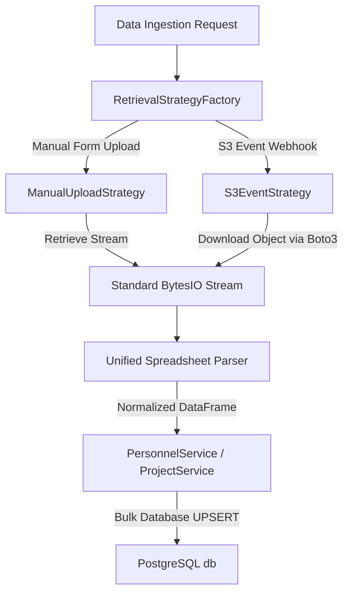

# ADR-009: Centralized Data Hub Ingestion & Retrieval Abstraction

## Status
Accepted

## Context & Problem Statement
With the evolution of the Verity Portal to a v1.1.0 "Data Hub" model, the system of records for master data (such as personnel records and project metadata) is ingested through multiple pathways. There are two primary channels:
1. **Manual browser uploads** where a user uploads a spreadsheet (`.csv`, `.xlsx`, `.numbers`) via the Data Hub UI.
2. **Automated S3 background syncs** triggered by secure file drops and S3 event-driven webhooks.

Previously, ingestion routes in `router.py` were tightly coupled with direct file upload mechanisms and manual browser-side headers parsing. As we add background event ingestion (e.g. S3 drops), the system risks duplicating parsing, normalization, validation, and mapping logic across controllers. 

We need to decouple the raw retrieval layer (how the spreadsheet bytes are fetched) from the database normalization and ingestion layer (how the system processes dataframes and handles updates/insertions), so the core business logic remains entirely agnostic of the data source.

## Decision
We will implement a **Retrieval Strategy Pattern** that defines a unified interface for extracting file streams, regardless of the retrieval context.

1. **`BaseRetrievalStrategy` (Interface):** Defines the standard contract with an `async def retrieve_stream(self) -> io.BytesIO` method and metadata properties (e.g., file extension/name).
2. **`ManualUploadStrategy` (Concrete Strategy):** Adapts FastAPI browser upload requests (`UploadFile`), loading the uploaded file directly into memory as a byte stream.
3. **`S3EventStrategy` (Concrete Strategy):** Triggered by S3 event notifications or webhooks. It uses a `boto3` client to fetch the object from the target AWS S3 bucket and stream the contents into memory asynchronously.
4. **`RetrievalStrategyFactory`:** Instantiates the appropriate strategy dynamically based on the incoming trigger request or webhook payload.
5. **Decoupled Dataframe Parser:** The routes fetch raw byte streams through the resolved strategy, and pass the stream to a unified dataframe parser that parses CSV, Excel, or Apple Numbers formats, feeding clean dataframes directly into `PersonnelService` or `ProjectService`.

## Rationale
- **Architectural Cohesion:** Restores single responsibility to our services. Services now handle mapping, fuzzy status normalization, and DB insertions, leaving file extraction to the retrieval strategy layer.
- **Improved Code Reuse:** Prevents duplicating parser or mapper code. The exact same parsing engines (supporting CSV, Excel, and Apple Numbers) process streams fetched either from S3 or from a browser request.
- **Better Testability & Mockability:** Isolates AWS integration. We can mock the `S3EventStrategy` or test the retrieval strategy independently using standard mock streams without running a full database transition test.

## Consequences
- **Positive:** A highly extensible, clean-architecture framework. Adding new ingestion sources in the future (e.g., an SFTP sync or a direct HTTP REST API integration) simply requires writing a new strategy class implementing `BaseRetrievalStrategy`.
- **Negative:** Minor increase in code abstractions for simple uploads, but fully justified by the scalability and test stability it provides.
- **Negative:** Requires background worker execution (via FastAPI `BackgroundTasks`) for large S3 events to prevent blocking standard API requests.
